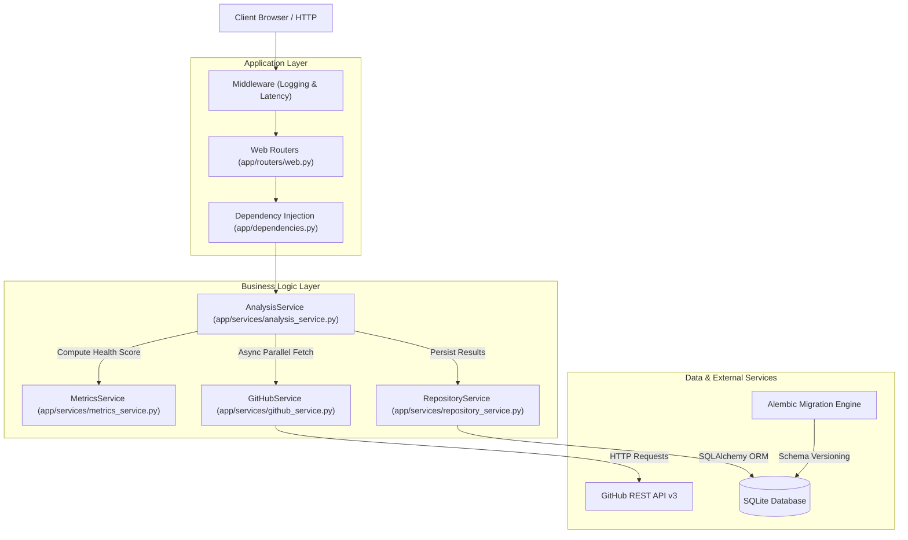
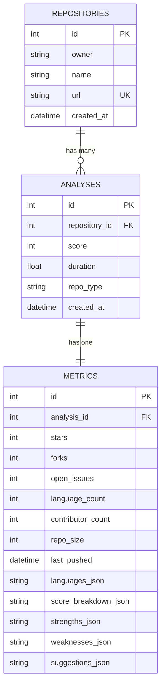

# ArchLens — Repository Intelligence Platform

<p align="center">
  <b>A high-precision engineering health and codebase quality analysis platform powered by FastAPI, SQLAlchemy, and GitHub API engine.</b>
</p>

---

## Key Features

- **Multi-Dimensional Codebase Scoring**: Calculates an overall engineering health score (0–100) across 5 core dimensions:
  - **Documentation**: README architecture overview, LICENSE permissions, CONTRIBUTING guidelines, and dedicated `docs/` directories.
  - **Activity & Velocity**: Commit frequency over 30 days and days since last release/push.
  - **Organization**: Dedicated source folders (`src/`, `app/`), test suites (`tests/`), and environment configuration manifests (`pyproject.toml`, `dockerfile`, `.env`).
  - **Community Engagement**: GitHub stars, forks, and unique active contributor base.
  - **Maintainability & CI/CD**: GitHub Actions workflows (`.github/workflows/`), open issue ratio, and overall disk size management.

- **Personalized Repository Profiles**:
  - **Open Source Library**: Standard strict scoring across all 5 dimensions.
  - **Personal Project**: Curved scoring that automatically forgives missing CI/CD workflows, low star/fork counts, and `CONTRIBUTING.md` guides.
  - **Enterprise App**: Strictly evaluates test coverage and CI/CD automation while bypassing public community metrics.

- **Modern Dark Glassmorphic Dashboard**:
  - Built with raw CSS, Plus Jakarta Sans typography, ambient radial glow spheres, and backdrop blur glassmorphism.
  - High-precision SVG circular score gauge with dynamic health tier badges (*Strong Codebase*, *Moderate Health*, *Needs Optimization*).
  - 6-tile frosted metadata strip (Stars, Forks, Open Issues, Contributors, Disk Size, Languages).
  - Multi-segment language distribution bars and categorised findings (Key Strengths, Areas of Concern, Actionable Recommendations).

- **Live Asynchronous GitHub Integration**: Async HTTP client (`httpx`) using `asyncio.gather()` to concurrently fetch live repository data, contents, workflows, languages, and commit history.
- **SQLite + Alembic Migration Engine**: Persistent storage for all historical analyses with versioned database migrations and dependency injection.
- **Full Test Coverage**: Comprehensive unit and integration test suite using Pytest and Starlette TestClient.
- **Containerized & Production-Ready**: Multi-stage Docker build producing a minimal container footprint.

---

## Architecture Diagram



---

## Data Schemas & Entity Relationship Diagram



---

## Project Structure

```text
ArchLens/
├── main.py                 # FastAPI application entry point
├── pyproject.toml          # PEP 621 project configuration & tool settings
├── app/
│   ├── config.py               # Environment configuration settings
│   ├── dependencies.py         # FastAPI dependency injection providers
│   ├── exceptions.py           # Custom application exception hierarchy
│   ├── models/                 # SQLAlchemy database models (Repository, Analysis, Metric)
│   ├── repositories/           # DB session management & DAO queries
│   ├── routers/                # FastAPI web routes (/, /analyze, /analysis/{id}, /history, /health)
│   ├── schemas/                # Pydantic validation schemas
│   ├── services/               # GitHub API client, scoring engine & analysis orchestrator
│   ├── templates/              # Jinja2 HTML templates (base, home, results, history, 404)
│   └── static/                 # Glassmorphic CSS design system & assets
├── alembic/                    # Database migration scripts
├── scripts/
│   └── seed.py                 # Script to seed live repository analysis data
├── tests/                      # Pytest unit & integration test suites
│   ├── unit/                   # Unit tests for services and parsers
│   └── integration/            # Integration tests for web routes and DB
├── Dockerfile                  # Multi-stage production container build
├── alembic.ini                 # Alembic migration configuration
├── requirements.txt            # Python dependencies
└── README.md                   # Project documentation
```

---

## Quick Start Guide

### Prerequisites
- **Python 3.11+**
- **Git**

### 1. Clone the Repository
```bash
git clone https://github.com/vishnuatgit/ArchLens.git
cd ArchLens
```

### 2. Create & Activate Virtual Environment
```bash
# On Linux/macOS
python3 -m venv .venv
source .venv/bin/activate

# On Windows (PowerShell)
python -m venv .venv
.venv\Scripts\activate
```

### 3. Install Dependencies
```bash
pip install -r requirements.txt
```

### 4. Run Database Migrations
Initialize the SQLite database schema using Alembic:
```bash
alembic upgrade head
```

### 5. (Optional) Configure GitHub Personal Access Token
Setting a GitHub Token increases your GitHub API rate limit from 60 to 5,000 requests per hour:
```bash
# On Linux/macOS
export GITHUB_TOKEN="your_personal_access_token"

# On Windows (PowerShell)
$env:GITHUB_TOKEN="your_personal_access_token"
```

### 6. Launch the FastAPI Development Server
```bash
uvicorn main:app --reload
```
Open your browser and navigate to **[http://127.0.0.1:8000](http://127.0.0.1:8000)**.

---

## Seeding Live Data

To pre-populate the database with live analysis runs from popular public repositories (e.g. `octocat/Hello-World`, `fastapi/fastapi`, `pallets/flask`):

```bash
python scripts/seed.py
```

---

## API Reference

| Method | Endpoint | Description |
| :--- | :--- | :--- |
| `GET` | `/` | Home page with URL input form, profile selector, and recent scans |
| `POST` | `/analyze` | Form submission endpoint to trigger full repository analysis |
| `GET` | `/analysis/{id}` | Detailed engineering report dashboard for a specific scan ID |
| `GET` | `/history` | Paginated analysis history page |
| `GET` | `/health` | System health check endpoint returning API status |

---

## Running Tests

ArchLens maintains a robust test suite covering services, web routes, and database operations.

Run all tests with Pytest:
```bash
# Set PYTHONPATH to the root directory
export PYTHONPATH=.   # Windows PowerShell: $env:PYTHONPATH="."
pytest -v
```

---

## Docker Deployment

To build and run the multi-stage production Docker container:

```bash
# 1. Build Docker Image
docker build -t archlens:latest .

# 2. Run Container
docker run -d -p 8000:8000 --name archlens-app archlens:latest
```

Access the containerized app at `http://localhost:8000`.
